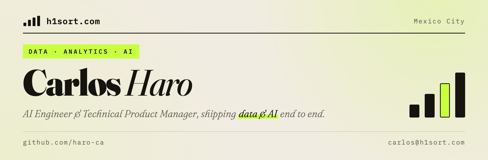

**AI Engineer & Technical Product Manager** at Santander AI, Mexico City. Eight years bridging deep technical execution and business strategy, shipping end-to-end data & AI across AWS, Azure and GCP.

- **FRED**: a structured fraud-analysis agent in production at Santander Mexico, 10k credit petitions analyzed in 1 hour
- **RAG in the wild**: a cloud RAG chatbot for the branch network and contact center
- **Teaching**: [Real-Time Data Processing](https://github.com/haro-ca/real-time-data-processing-class), a 12-lesson hands-on course (OLTP, CDC, Kafka, stream processing, real-time OLAP)

More at **[h1sort.com](https://h1sort.com)**: [Talking](https://h1sort.com/talking/) · [Writing](https://h1sort.com/writing/) · [Teaching](https://h1sort.com/teaching/) · [CV](https://h1sort.com/cv/) · [Contact](https://h1sort.com/contact/)

[carlos@h1sort.com](mailto:carlos@h1sort.com) · [LinkedIn](https://www.linkedin.com/in/h1sort) · [X](https://x.com/h1sort)
